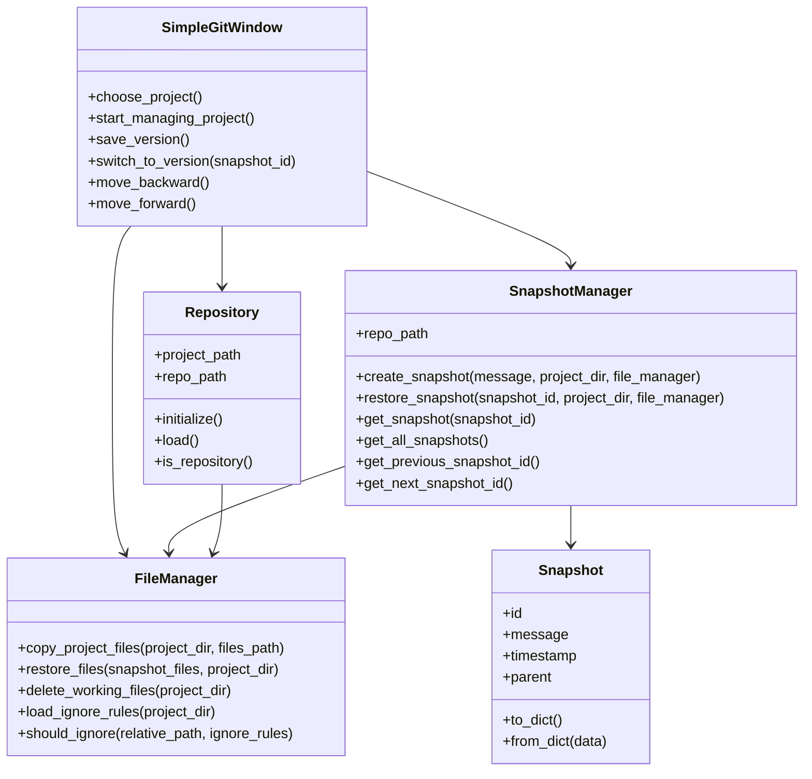
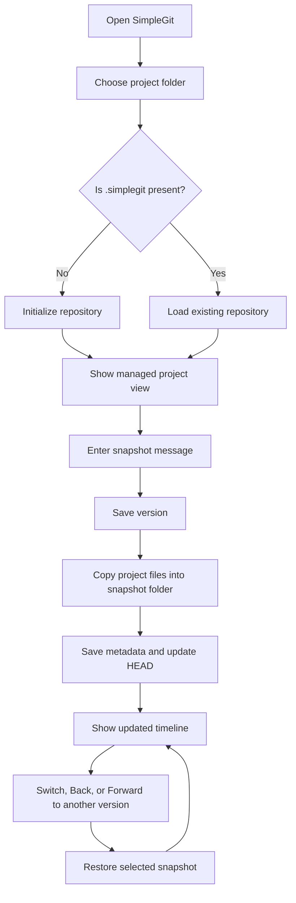
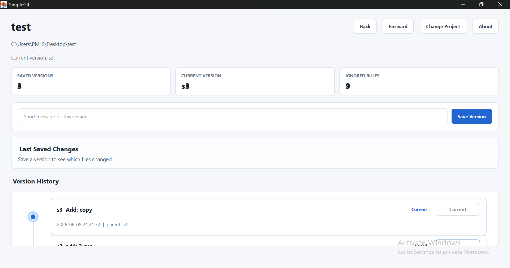

# SimpleGit

A lightweight educational version control system built with Python and PyQt6.

--- 
Website Link: [https://razamindset.github.io/simplegit](https://razamindset.github.io/simplegit)
---

# Project Overview

SimpleGit is a simplified graphical version control system inspired by Git.

The purpose of the project is to:
- learn Object-Oriented Programming (OOP)
- understand version control concepts
- practice GUI development
- practice file system management
- collaborate as a software team

This is NOT intended to replace Git.

Instead, it is a learning-focused snapshot management system.

---

# OOP Lab Justification

SimpleGit was designed as a 3-person OOP lab project with separate responsibilities for core logic, GUI interaction, and release/documentation work. The project demonstrates object-oriented design by splitting the application into focused classes instead of placing all behavior in one file.

## OOP Concepts Used

| OOP Concept | How SimpleGit Uses It |
|---|---|
| Classes and Objects | `Repository`, `Snapshot`, `SnapshotManager`, `FileManager`, and GUI widgets model different parts of the system. |
| Encapsulation | File copying, restoring, and ignore-rule handling are hidden inside `FileManager`. Snapshot operations are handled inside `SnapshotManager`. |
| Abstraction | The GUI calls simple methods such as `initialize()`, `create_snapshot()`, and `restore_snapshot()` without needing to know every file-system detail. |
| Composition | `SimpleGitWindow` uses `Repository`, `SnapshotManager`, and `FileManager` objects together to provide the full workflow. |
| Separation of Concerns | Core version-control logic is kept in `core/`, while PyQt6 interface code is kept in `gui/`. |
| Data Modeling | The `Snapshot` dataclass represents each saved version with an ID, message, timestamp, and parent snapshot. |

## 3-Person Team Contribution Split

| Team Member | Main Responsibility | Related Files |
|---|---|---|
| Ali Raza Khalid | Snapshot system, GUI application, and executable build setup. | `core/snapshot.py`, `gui/window.py`, `main.py`, `build.ps1`, `requirements.txt` |
| Fiza Batool | File manager logic and project documentation. | `core/file_manager.py`, `README.md`, `GUIDE.md` |
| Mahnoor Ali | Repository class and website. | `core/repository.py`, `docs/` |

## Class Diagram



## Application Flow



---

# Screenshots

## Main Dashboard



## Choose Project


---

# Main Features

## Current Features

- Initialize repository
- Create snapshots
- Navigate backward through snapshots
- Navigate forward through snapshots
- Timeline/history viewing
- GUI interaction using PyQt6
- Snapshot restoration
- Changed-file summary after each saved snapshot
- Project stats cards for saved versions, current version, and ignored rules
- About dialog with project purpose and team responsibilities
- Windows executable build using PyInstaller
- Static download website in `docs/`

---

# Run The App

```powershell
python main.py
```

If dependencies are missing:

```powershell
python -m pip install -r requirements.txt
```

---

# Build A Shareable Windows EXE

The project includes `build.ps1`, which:

- installs requirements
- creates `assets/icon.ico` from `icon.png`
- builds `dist/SimpleGit.exe`
- prepares the Windows executable for release

Run:

```powershell
.\build.ps1
```

The website can be opened at:

```txt
docs/index.html
```

---

# Future Features

Potential future features:
- Multiple timelines
- Visual graph timelines
- Diff viewer
- Auto snapshots
- Tags/releases
- Export/import repositories

---

# Tech Stack

| Component | Technology |
|---|---|
| Language | Python |
| GUI | PyQt6 |
| Data Storage | JSON |
| File Operations | shutil |
| Path Management | pathlib |

---

# Repository Structure

When a project is initialized:

```txt
MyProject/
│
├── project files
│
└── .simplegit/
    │
    ├── snapshots/
    │   ├── s1/
    │   ├── s2/
    │   └── s3/
    │
    ├── timeline/
    │   └── main.json
    │
    ├── HEAD.json
    ├── config.json
    └── ignore.txt
```

---

# Folder Purpose

## snapshots/

Stores complete copies of project states.

Each snapshot contains:
- project file copies
- metadata

Example:

```txt
s1/
│
├── files/
│   ├── main.py
│   └── app.py
│
└── meta.json
```

---

## timeline/

Stores timeline history.

Example:

```json
{
  "timeline_name": "main",
  "snapshots": [
    "s1",
    "s2",
    "s3"
  ]
}
```

---

## HEAD.json

Tracks current snapshot position.

Example:

```json
{
  "current_snapshot": "s3"
}
```

---

## config.json

Stores repository configuration.

Example:

```json
{
  "repo_name": "MyProject",
  "created_at": "2026-05-13"
}
```

---

## ignore.txt

Functions similarly to `.gitignore`.

Contains folders/files to skip.

Example:

```txt
node_modules
__pycache__
.venv
dist
build
```

---

# Main Commands

Although the application is GUI-first, these internal command concepts exist.

| Command | Purpose |
|---|---|
| `simplegit init` | Initialize repository |
| `simplegit snapshot` | Save project state |
| `simplegit timeline` | Show snapshot history |
| `simplegit backward` | Restore previous snapshot |
| `simplegit forward` | Restore next snapshot |

---

# Core Design Philosophy

SimpleGit uses:

## Full Snapshot Storage

Every snapshot stores:
- complete project copies

Advantages:
- easier implementation
- easier restoration
- simpler OOP structure
- easier debugging

Disadvantages:
- more storage usage

This tradeoff is acceptable for educational purposes.

---

# Snapshot System

## Snapshot Creation Flow

```txt
User clicks Snapshot
    ↓
Enter snapshot message
    ↓
Generate snapshot ID
    ↓
Copy project files
    ↓
Save metadata
    ↓
Update timeline
    ↓
Update HEAD
```

---

# Snapshot Metadata

Example:

```json
{
  "id": "s3",
  "message": "Added login UI",
  "timestamp": "2026-05-13 14:22",
  "parent": "s2"
}
```

---

# Navigation System

SimpleGit currently supports:
- single timeline only

Navigation works similarly to:
- undo/redo systems

---

## Backward

Moves to previous snapshot.

Process:
1. Find previous snapshot
2. Delete current project files
3. Restore files from target snapshot
4. Update HEAD

---

## Forward

Moves to next snapshot.

Process:
1. Find next snapshot
2. Delete current project files
3. Restore snapshot files
4. Update HEAD

---

# Important Safety Rule

The `.simplegit/` folder MUST NEVER be copied into snapshots.

Otherwise recursive snapshot copying occurs.

---

# GUI Architecture

The GUI layer MUST remain separate from core logic.

GUI should:
- call methods
- display results
- show dialogs

GUI should NOT:
- directly manipulate repository files

---

# Application Architecture

The project follows a simplified MVC-style architecture.

---

# Folder Structure (Source Code)

```txt
simplegit/
│
├── core/
│   ├── repository.py
│   ├── snapshot_manager.py
│   ├── timeline_manager.py
│   ├── file_manager.py
│   └── snapshot.py
│
├── gui/
│   ├── main_window.py
│   ├── snapshot_dialog.py
│   └── timeline_view.py
│
├── utils/
│   ├── json_utils.py
│   └── path_utils.py
│
└── main.py
```

---

# Core Classes

# 1. Repository

Main controller class.

Responsibilities:
- initialize repository
- load repository
- coordinate managers

Methods:

```python
initialize()
load()
is_repository()
```

---

# 2. SnapshotManager

Handles snapshot operations.

Methods:

```python
create_snapshot()
restore_snapshot()
get_snapshot()
```

---

# 3. TimelineManager

Handles snapshot navigation.

Methods:

```python
move_backward()
move_forward()
get_history()
```

---

# 4. FileManager

Handles:
- file copying
- restoration
- ignore rules

Methods:

```python
copy_project_files()
restore_files()
delete_working_files()
```

---

# 5. Snapshot

Represents a snapshot object.

Attributes:

```python
id
message
timestamp
parent
```

---

# GUI Design

# Main Window

Main application screen.

Contains:
- open project button
- snapshot button
- backward button
- forward button
- history/timeline list
- project information

---

# Initial GUI Flow

```txt
Open Application
    ↓
Select Project Folder
    ↓
Check for .simplegit/
    ↓
If missing:
    show Initialize button
    ↓
Load repository
```

---

# Planned GUI Layout

```txt
+------------------------------------------------+
| SimpleGit                                      |
+------------------------------------------------+
| [Open] [Snapshot] [Backward] [Forward]         |
+------------------------------------------------+
|                                                |
| Files              | Timeline                  |
|                    |                            |
| main.py            | s1 Initial                |
| app.py             | s2 Added GUI              |
|                    | s3 Fixed Bug              |
|                                                |
+------------------------------------------------+
| Current Snapshot: s3                           |
+------------------------------------------------+
```

---

# Snapshot Restoration Rules

When restoring:
- current working files are removed
- snapshot files are copied back
- `.simplegit/` remains untouched

---

# Ignored Files

Ignored paths are read from:

```txt
.simplegit/ignore.txt
```

Ignored folders/files should not be:
- copied
- restored
- tracked

---

# Development Phases

# Phase 1 — Core Repository

Goals:
- initialize repository
- load repository
- basic file structure

---

# Phase 2 — Snapshot System

Goals:
- create snapshots
- restore snapshots
- metadata system

---

# Phase 3 — Navigation

Goals:
- backward navigation
- forward navigation
- HEAD tracking

---

# Phase 4 — GUI Integration

Goals:
- connect buttons
- dialogs
- timeline list
- project explorer

---

# Phase 5 — Polishing

Goals:
- error handling
- confirmations
- improved UI
- cleanup

---

# Team Collaboration Rules

## Rule 1

Core logic and GUI should remain separate.

---

## Rule 2

Do not hardcode paths.

Use:
- pathlib
- utility functions

---

## Rule 3

Every major feature should have:
- dedicated class
- clear responsibility

---

## Rule 4

Avoid placing business logic inside GUI files.

---

## Rule 5

Use descriptive method names.

GOOD:

```python
create_snapshot()
```

BAD:

```python
doStuff()
```

---

# Coding Style

## Naming

| Type | Style |
|---|---|
| Classes | PascalCase |
| Functions | snake_case |
| Variables | snake_case |
| Constants | UPPER_CASE |

---

# Example

```python
class SnapshotManager:
    pass
```

---

# Error Handling

The application should handle:
- invalid repositories
- missing snapshots
- permission errors
- file conflicts
- restore failures

Gracefully using dialogs/messages.

---

# Future Improvements

Possible advanced improvements:
- snapshot compression
- deduplication
- graph visualization
- diff algorithms
- multi-timeline support

---

# Project Goal

The primary goal of SimpleGit is educational value.

The project focuses on:
- software architecture
- OOP design
- filesystem management
- GUI application structure
- teamwork and collaboration
